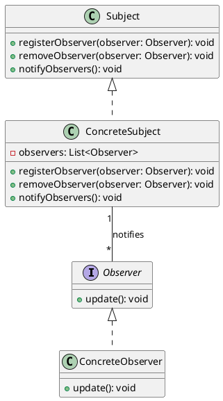
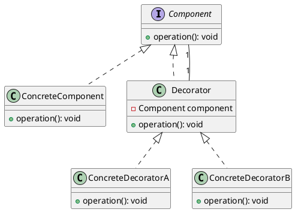

# 设计模式

记录一些设计模式的代码示例

## 代码来源

* head first 设计模式
* 大话设计模式

## 目前已实现

* 观察者模式 Observer
* 装饰者模式 Decorator

  
### 观察者模式 Observer

> GoF 定义：
> 
> **观察者模式**定义了对象之间的一对多依赖，这样一来，当一个对象改变状态时，它的所有依赖者都会收到通知并自动更新。

UML 类图如下：

### 装饰者模式 Decorator

> GoF 定义：
> 
> **装饰者模式** 动态地将责任附加到对象上。 若要扩展功能，装饰者提供了比继承更有弹性 的替代方案。

UML 类图如下：
