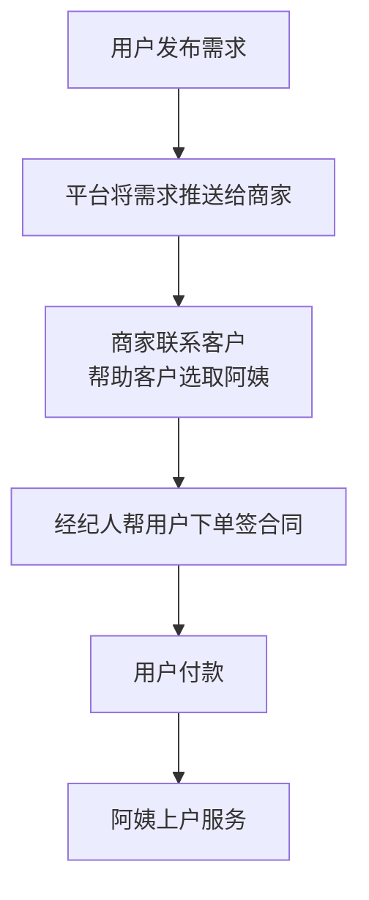
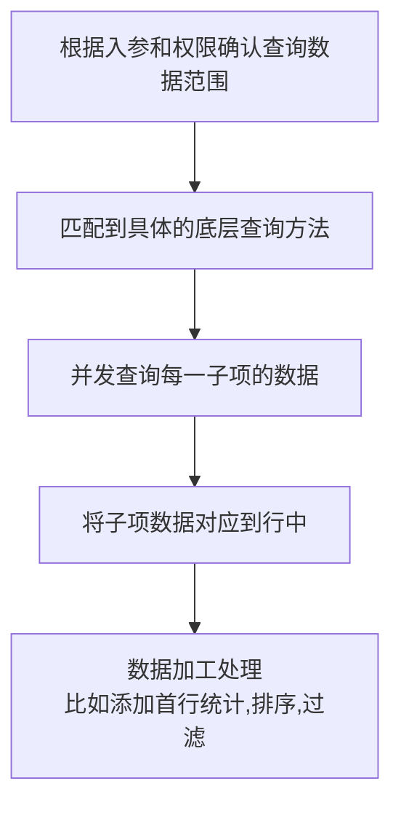
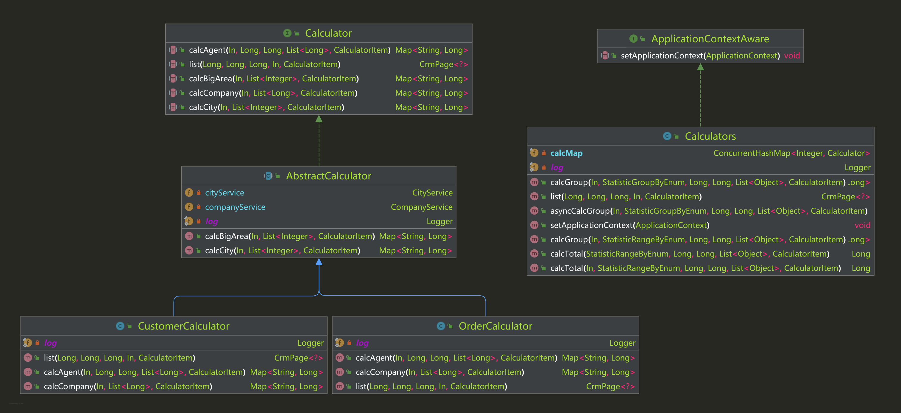
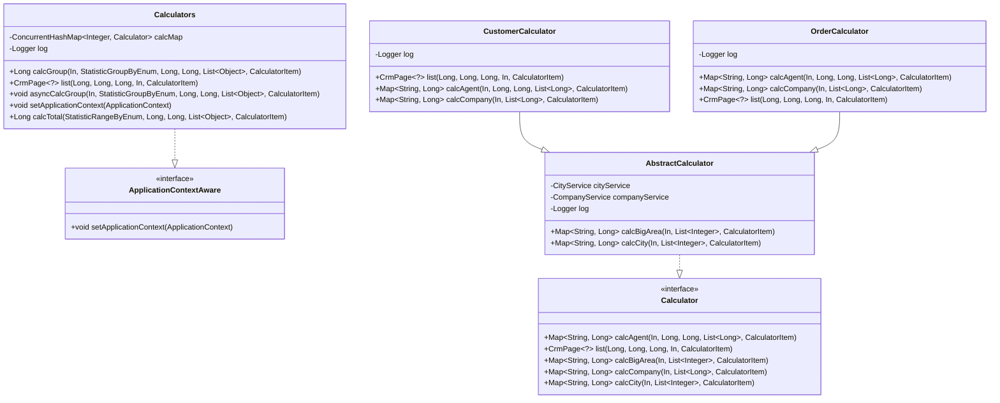
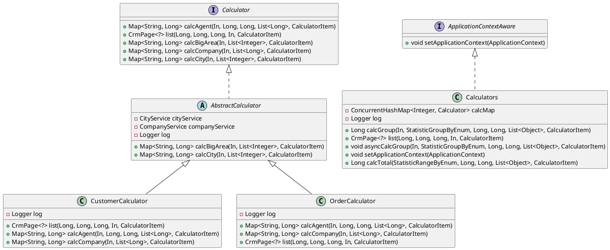

# 可视化分层级的数据统计表格框架

## 项目由来

这个框架是之前在公司中统计数据的一个架子，个人觉得非常牛逼，故在此记录简版架构。

说是可视化分层级的数据统计表格框架，其实就是多层级的数据统计展示，带有权限控制和上下钻取的能力。

## 项目背景
整体项目是一个四方 saas，大致的流程如下。

### 项目需求

为了加强商家数据管控，提出了这个数据面板的需求。

数据面板可以分为三大模块：

* 面板（一级页）

  * 根据数据类型分成几大区域展示，每大区域代表一种数据类型，区域中显示该数据类型中的具体查询项的数量
  * 比如某区域代表 **订单** 数据类型，里面具体分为**待支付单量、签单量、退单量等**

* 数据列表（二级页）

  * 面板中点击大区块，下钻进入二级页，行代表对应查询范围的代表值（比如城市、公司、经纪人），列代表具体查询项目（待支付单、签单、退单）

  * 点击具体行头，会继续下钻，展开顺序：大区 -> 城市 -> 公司 -> 经纪人

    | 维度\类型 | 待支付单 | 签单量 | 退单量 |
    | --------- | -------- | ------ | ------ |
    | **北京**  | 2344     | 2342   | 523    |
    | **上海**  | 3214     | 1243   | 134    |
    | **深圳**  | 5346     | 3453   | 657    |

* 数据详情列表（三级页）

  * 点击二级页中数字，会跳转到具体详情页列表
    * 仅展示公司层级和经纪人层级数据
  * 比如点击某公司的待支付单对应的数字，会进入到详情页列表，里面展示了该公司所有待支付单的详细列表
  * 支持按列排序

按终端区分，总共分为两端：商家端和平台端，每端具体展示逻辑有些不同。

#### 平台端

平台端分成两种角色

* 全国管理员
  * 可以查看全国各地所有数据
  * 一级页展示全国数据
  * 二级页：大区 -> 城市 -> 公司 -> 经纪人
* 城市运营
  * 可以查看负责的所有城市的数据（一个运营可能负责多个城市）
  * 一级页展示负责城市数据
  * 二级页：负责城市 -> 公司 -> 经纪人

#### 商家端

商家端分成三种角色：

* 管理员
  * 可以查看公司所有数据
  * 二级页：经纪人
* 店长
  * 可以查看门店所有数据
  * 二级页：经纪人
* 经纪人
  * 无查看功能

### 需求难点

* 数据范围广，且来源不同
  * 数据几乎横跨所有项目，不同数据还要从不同库表、甚至不同项目中取
* 需要极快的响应速度，并且对数据实时性有要求
  * 每个页面都需要大量的请求数据与计算，且来源不同，正常写法时间要求肯定不合格
  * 由于对数据实时性有要求，所以不能像其他报表那种，半夜计算一次，缓存一天
* 逻辑复杂
  * 严格的权限控制
  * 需求给出的查询项，将近 50 种
* 可拓展性强，可维护性强
  * 需要后续易于添加大的数据类型，以及具体的查询项
* 对整体项目需要比较了解
  * 由于数据查询几乎横跨了所有项目，所以需要对整体项目都有了解
* 开发时间紧张
  * 卡死了上线时间

## 项目设计

### 分析

**根据需求页面可以拆分出三种不同的接口**

* 面板（一级页）
  * dashboard
* 数据列表（二级页）
  * aggList
* 数据详情列表（三级页）
  * aggDetail

**接口速度问题**

* 无法使用缓存
  * 由于实时性的要求，几乎无法使用缓存，除非原本相关数据查询接口已经有缓存
  * 查询数据几乎横跨所有项目，不可能在所有数据变动点处都进行改动，添加缓存
* 考虑使用多线程
  * 瓶颈在查询具体数据处，考虑在查询项处，使用多线程，同时查询

**查询项**

* 数据类型维度
  * 如：订单维度
* 具体查询子项
  * 如：待支付、已签单、退单量

**二级页元素**

- 行的列表
- 列的列表
- 行列对应的数量

**列查询**

* 每一列是一种数据，所以要按列查询
* 列查询出后，再去匹配行，组装数据

**数据层级**

- 大区
- 城市
- 公司
- 经纪人

**两个维度**

- 聚合维度 groupBy
  - 数据具体查询时，使用的聚合维度
    - 比如当前行头是城市，那么聚合维度就是城市，按照城市分组统计
  - 具体分为
    - 大区
    - 城市
    - 公司
    - 经纪人
- 限制维度 rangeBy
  - 数据查询的限制范围
    - 比如当前行头是公司，那么限制维度就是城市，表示某一城市下的所有公司
  - 具体分为
    - 大区
    - 城市
    - 公司
    - 经纪人

**底层方法**

* **数量查询**
  * 最终要落实到四个分组查询
    * 按大区分组
    * 按城市分组
    * 按公司分组
    * 按经纪人分组
* **详情列表查询**
  * 需要一个按照公司和经纪人查询的列表查询

### 具体设计

#### API 设计

商家端和平台端各自 3 个 API

* `dashboard`
  * 无需入参
  * 返回所有区域信息和对应的查询项信息
* `statisticList`
  * 入参：
    * `rangeBy`：数据限制类型，商家端不需要
    * `rangeId`：数据限制主键，比如大区 id，城市 id 等，商家端不需要
    * `queryBy`：查询数据类型
    * `sortBy`：排序字段
    * `order`：排序方向，`asc` 或 `desc`
  * 返参：
    * 行头列表，也就是第一列信息
    * 行列表，每一行的信息
      * 行 VO 包含了所有查询子项，仅当前页面查询的子项有数据返回
* `detailList`
  * 入参：
    * `companyId`：公司 id
    * `agentId`：经纪人 id，非必须
    * `clickItem`：点击的查询项
    * `showType`：点击数据行类型，有些行比较特殊，比如首行汇总等
  * 返参：
    * 需要的信息

#### 整体流程

#### 查询器设计

**整体说明**

使用策略模式封装不同数据类型的查询方式

* 接口 `Calculator` 提供了上述的 5 种底层方法

* 抽象类 `AbstractCalculator` 使用模版方法模式提供大区和城市的查询
* 具体策略实现类 `CustomerCalculator` 和 `OrderCalculator` 实现具体对应子项的数据查询功能

* 工具管理类 `Calculators` 管理具体实现类的注册和调用，同时支持异步、分组、总计等功能，内部通过 `calcMap` 实现策略路由

**类图**

mermaid

plantUML

