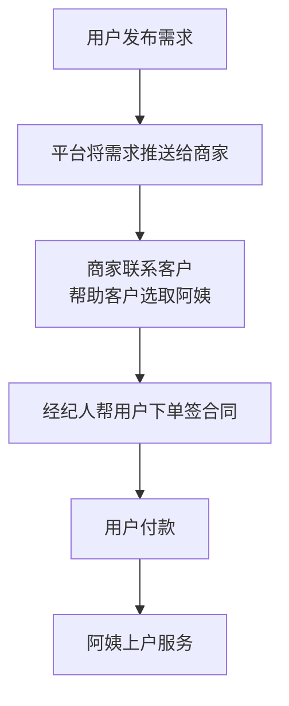

# 可视化分层级的数据统计表格框架

## 项目由来

这个框架是之前在公司中统计数据的一个架子，个人觉得非常牛逼，故在此记录简版架构。

说是可视化分层级的数据统计表格框架，其实就是多层级的数据统计展示，带有权限控制和上下钻取的能力。

## 项目背景
整体项目是一个四方 saas，大致的流程如下。

### 项目需求

为了加强商家管控，提出了这个数据面板的需求。

数据面板可以分为三大模块：

* 面板（一级页）

  * 根据数据类型分成几大块展示，每大块中有该数据类型下更细粒度的数据展示
  * 比如某一大块代表订单相关数据，里面具体分为待支付单、签单、退单等

* 数据列表（二级页）

  * 面板中点击大区块，下钻进入二级页，行代表对应查询范围的代表值（比如城市、公司、经纪人），列代表具体查询的数据类型（待支付单、签单、退单）

  * 点击具体行头，会继续下钻，展开顺序：大区 -> 城市 -> 公司 -> 经纪人

    | 维度\类型 | 待支付单 | 签单量 | 退单量 |
    | --------- | -------- | ------ | ------ |
    | **北京**  | 2344     | 2342   | 523    |
    | **上海**  | 3214     | 1243   | 134    |
    | **深圳**  | 5346     | 3453   | 657    |

* 数据详情列表（三级页）

  * 点击二级页中数字，会跳转到具体详情页列表
  * 比如点击北京的待支付单对应的数字，会进入到详情页列表，里面展示了北京所有待支付单的详细列表

总共分为两端：商家端和平台端，每端具体展示逻辑有些不同。

#### 平台端

平台端分成两种角色

* 全国管理员
  * 可以查看全国各地所有数据
  * 一级页展示全国数据
  * 二级页：大区 -> 城市 -> 公司 -> 经纪人
* 城市运营
  * 可以查看负责的所有城市的数据（一个运营可能负责多个城市）
  * 一级页展示负责城市数据
  * 二级页：负责城市 -> 公司 -> 经纪人

#### 商家端

商家端分成三种角色：

* 管理员
  * 可以查看公司所有数据
  * 二级页：经纪人
* 店长
  * 可以查看门店所有数据
  * 二级页：经纪人
* 经纪人
  * 无查看功能

### 需求难点

* 数据范围广，且来源不同
  * 数据几乎横跨所有项目，不同数据还要从不同库表、甚至不同项目中取
* 需要极快的响应速度，并且对数据实时性有要求
  * 每个页面都需要大量的请求数据与计算，且来源不同，正常写法时间要求肯定不合格
  * 由于对数据实时性有要求，所以不能像其他报表那种，半夜计算一次，缓存一天
* 逻辑复杂
  * 严格的权限控制
  * 需求给出的查询项，将近 50 种
* 对整体项目比较了解
  * 由于数据查询几乎横跨了所有项目，所以需要对整体项目都有了解
* 开发时间紧张
  * 卡死了上线时间

## 项目设计

### 分析

**根据需求页面可以拆分出三种不同的接口**

* 面板（一级页）
  * dashboard
* 数据列表（二级页）
  * aggList
* 数据详情列表（三级页）
  * aggDetail

**接口速度问题**

* 无法使用缓存
  * 由于实时性的要求，几乎无法使用缓存，除非原本相关数据查询接口已经有缓存
  * 查询数据几乎横跨所有项目，不可能在所有数据变动点处都进行改动，添加缓存
* 考虑使用多线程
  * 瓶颈在查询具体数据处，考虑在查询项处，使用多线程，同时查询

**查询项**

* 数据来源维度
  * 如：订单维度
* 具体查询子项
  * 如：待支付、已签单、退单量

**二级页元素**

- 行的列表
- 列的列表
- 行列对应的数量

**数据层级**

- 大区
- 城市
- 公司
- 经纪人

**两个维度**

- 聚合维度 groupBy
  - 大区
  - 城市
  - 公司
  - 经纪人
- 限制维度 rangeBy
  - 大区
  - 城市
  - 公司
  - 经纪人

